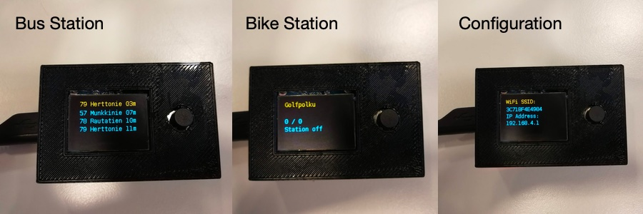
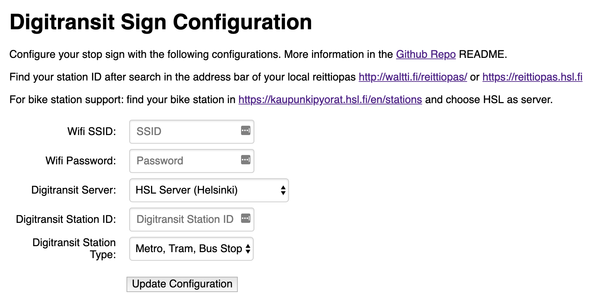

# digitransit-busstop-sign


Finland public transport sign based on ESP8266 or ESP32

  - Queries data from digitransit with GraphQL
  - Gets current timestamp via NTP
  - Display current waiting time on Serial and I2C Display
    - I2C OLED display supported
    - 20x4 Liquid Crystal display supported


```
[WIFI] connecting to wifi ...
[WIFI] not connected to wifi, retry ...
[WIFI] not connected to wifi, retry ...
[WIFI] connected

[HTTP] start query ...
[HTTP] query result code: 200

[JSON] parsing response ...
[JSON] success

[NTP] query current time ...
[NTP] timestamp 1544374441

[DIGITRANSIT] Station:    Erik Spåren tie
[DIGITRANSIT] 506 Meilahti vi 03m
[DIGITRANSIT]  78 Rautatiento 05m
[DIGITRANSIT]  79 Herttoniemi 11m
[DIGITRANSIT]  57 Munkkiniemi 16m
```


## Features

* Connects to your WiFi
* Shows realtime timetables for bus, tram and metro stations
* Shows availables bikes in bike stations
* Turns off after 5 mimnutes
* Easy configuration with wifi hotstop web-ui
* Send `'c'` via serial during bootup for reconfiguration
* Turns off after `n` minutes. (set to 0 to run endlessly)

## Usage

How to build your own Station Sign:

1. Set all needed variables in `platformio.ini`
  - `display` - `0` for Liquid Crystal Display and `1` for OLED Display
  - `display_address` - I2C display address
2. Install PlatformIO and flash NodeMCU
  - `pip install -U platformio`
  - `platformio update`
  - `platformio run --target upload`
3. Power the device and wait 20 Seconds until access point is shown on the display
4. Connect to it and open the shown address in your browser
5. Apply configurations as shown in the web ui

> Enclosure examples for both display types can be found in `case/`.




### Partlist

For the basic usage only the NodeMcu and LCD display is needed.

* NodeMCU ESP32 or NodeMCU ESP8266
* LCD Display 20x4 with I2C Adapter or OLED I2C Display
* [Tactile Push Button]
* [10k Resistor]
* [Lithium Ion Battery 3.7]
* [5V stepup board with charging circuit]

