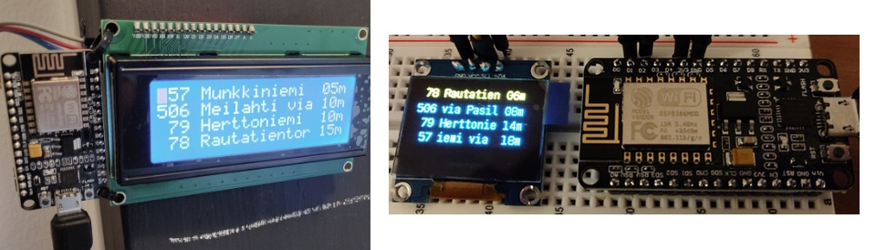
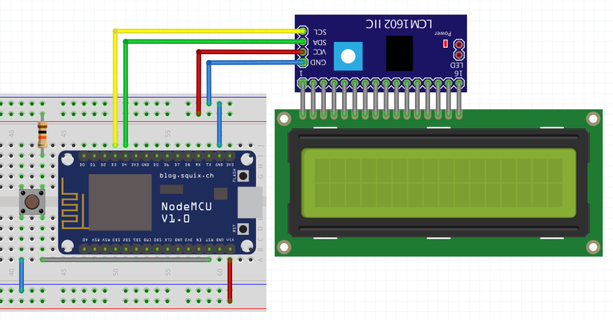

# hsl-busstop-sign
[](https://travis-ci.com/stetro/hsl-busstop-sign)
Finland public transport sign based on ESP8266 or ESP32

  - Queries data from digitransit with GraphQL
  - Gets current timestamp via NTP
  - Display current waiting time on Serial and I2C Display
    - I2C OLED display supported
    - 20x4 Liquid Crystal display supported



```
[WIFI] connecting to wifi ...
[WIFI] not connected to wifi, retry ...
[WIFI] not connected to wifi, retry ...
[WIFI] connected

[HTTP] start query ...
[HTTP] query result code: 200

[JSON] parsing response ...
[JSON] success

[NTP] query current time ...
[NTP] timestamp 1544374441

[DIGITRANSIT] Station:    Erik Spåren tie
[DIGITRANSIT] 506 Meilahti vi 03m
[DIGITRANSIT]  78 Rautatiento 05m
[DIGITRANSIT]  79 Herttoniemi 11m
[DIGITRANSIT]  57 Munkkiniemi 16m
```



## Usage

How to build your own Station Sign:

1. Find your station ID after search in the address bar of your local reittiopas http://waltti.fi/reittiopas/ or https://reittiopas.hsl.fi
2. Set all needed variables in `platformio.ini`
  - `digitransit_station_id` - GraphQL HSL or Waltti Station ID
  - `digitransit_id` - To switch between HSL and Waltti (`hsl` or `waltti`)
  - `display` - `0` for Liquid Crystal Display and `1` for OLED Display
  - `display_address` - I2C display address
  - `wifi_ssid` and `widi_password`
3. Install PlatformIO and flash NodeMCU
  - `pip install -U platformio`
  - `platformio update`
  - `platformio run --target upload`

### Partlist

For the basic usage only the NodeMcu and LCD display is needed.

* NodeMCU ESP32 or NodeMCU ESP8266
* LCD Display 20x4 with I2C Adapter or OLED I2C Display
* [Tactile Push Button]
* [10k Resistor]
* [Lithium Ion Battery 3.7]
* [5V stepup board with charging circuit]

